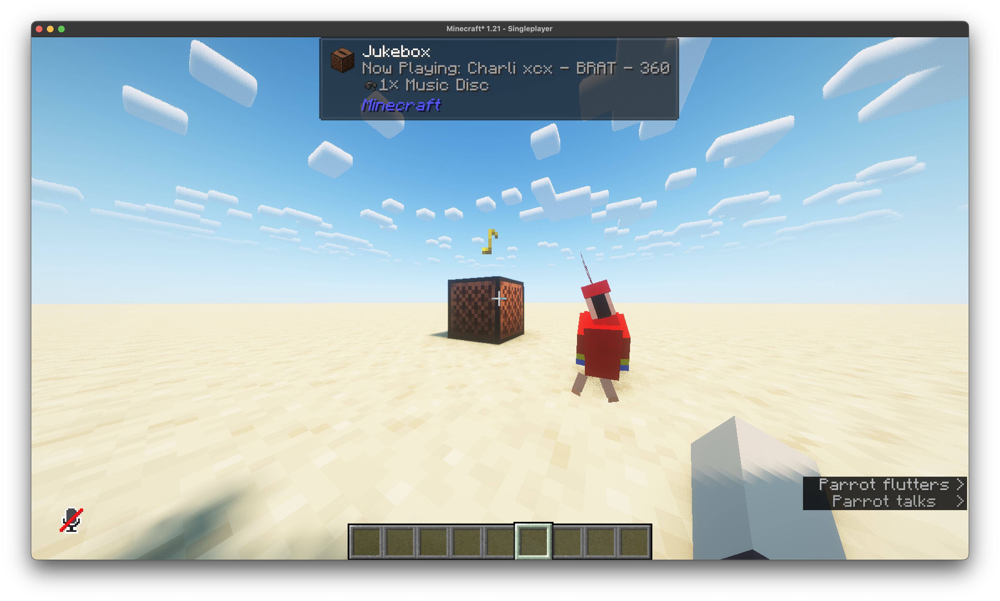

# Minecraft Music Disc Packer

packs a folder of Ogg Vorbis files into a minecraft resource pack and data pack, with functions to spawn in music discs

in other terms: use this tool if you want to provide custom soundtracks on your minecraft server, server-side!

## Usage:

After building, execute `dotnet MinecraftMusicDiscPacker.dll [source] [target]`.

`[source]` is a folder containing your desired `.ogg` vorbis files, and `[target]` is a folder where you want the generated outputs to be put.

Once finished, you will get a `ResourcePack` and `DataPack` folder output. You can upload the data pack to your server, and, set the resource pack as your server resource pack. Once complete, you can run /function discpacker:[songid] to give yourself a custom music disc.

## FAQs

> How can I build this?

Make sure you have an up to date .NET SDK.

Then - clone this to your machine, and run `dotnet build`.

> My song is audible all throughout the world!

Make sure your audio is encoded as Mono instead of Stereo.

## Details

The following format is used for song IDs:

`[artistname][albumname][trackname]-[durationinms]`

In cases where a property isn't set, it will default to an empty string. Characters will also be transformed to lower case, and, any characters not inside `abcdefghijklmnopqrstuvwxyz0123456789` will be stripped.

For example - Mean Girls, from Charli XCX's BRAT album will be transformed to `charlixcxbratmeangirls-189410`. As such, the command to spawn this disc in will be `/function discpacker:charlixcxbratmeangirls-189410`.

